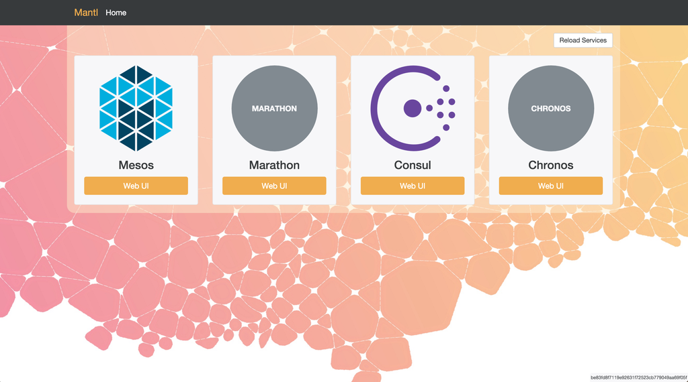

# Mantl UI frontend

A frontend for [Mantl UI](https://github.com/CiscoCloud/nginx-mantlui).

It looks a bit like this:

<!-- markdown-toc start - Don't edit this section. Run M-x markdown-toc-generate-toc again -->
**Table of Contents**

- [Mantl-UI frontend](#mantl-ui-frontend)
    - [Developing](#developing)
        - [Tests](#tests)

<!-- markdown-toc end -->

## Developing

1. Install [Elm](http://elm-lang.org/install)
2. Install Elm dependencies: `elm package install`
3. Install Node dependencies: `npm install`
4. Install netpbm: `brew install netpbm` (on a Mac)
5. Install [Brunch](http://brunch.io) globally: `npm install -g brunch`
6. Run `brunch watch --server` to continuously compile
7. View the app at [localhost:3333](http://localhost:3333/)

### Tests

To run the tests, run `elm reactor` and then open
[localhost:8000/app/Test.elm](http://localhost:8000/app/Test.elm)

### Preparing for Production

1. Make sure jpegtran and optipng are installed (`brew install jpeg optipng`)
2. Remove development artifacts: `rm -rf public`
3. Create production artifacts: `brunch build --production`
